<br />
<p align="center">
  <a href="https://github.com/CoteTommy/Rocket-Elevator-Foundation">
    
  </a>

  <h3 align="center">Rocket Elevators Foundation 🚀</h3>

  <p align="center">
    This a rails application for Rocket Elevators.
    <br />
    <a href="https://github.com/CoteTommy/Rocket-Elevator-Foundation"><strong>Explore the project »</strong></a>
    <br />
    <br />
    <a href="http://tommycote.com/">View Website</a>
    ·
    <a href="https://tommyrocket.zendesk.com/">Zendesk Dashboard</a>
    <br />
    <a href="https://github.com/CoteTommy/Rocket-Elevator-Foundation-REST">REST API Repo</a>
    .
    <a href="https://github.com/CoteTommy/Rocket-Elevator-Foundation-Graphql">Graphql API Repo</a>
  </p>
</p>

```html
Main Website: http://tommycote.com/
Zendesk Dashboard: https://tommyrocket.zendesk.com/
Rest Repo: https://github.com/CoteTommy/Rocket-Elevator-Foundation-REST
Rest URL: https://rocketfoundationrestapi.herokuapp.com/
Graphql Repo: https://github.com/CoteTommy/Rocket-Elevator-Foundation-Graphql
Graphql URL: https://rocketfoundationgraphqlapi.herokuapp.com/graphql
```

<!-- TABLE OF CONTENTS -->
<details open="open">
  <summary><h2 style="display: inline-block">Table of Contents 🎯</h2></summary>
  <ol>
    <li>
      <a href="#-round_pushpin-about-the-project">About The Project</a>
      <ul>
        <li><a href="#built-with">Built With</a></li>
        <li><a href="#using-the-following-apis">Using the following APIs</a></li>
      </ul>
    </li>
    <li>
      <a href="#installation">Installation</a>
      <ul>
        <li><a href="#pencil2-to-setup-the-database">Setup The Database</a></li>
        <li><a href="#pencil2-to-run-the-application">Run The Application</a></li>
      </ul>
    </li>
    <li><a href="#large_blue_circle-now-that-the-server-is-running">Now That The Server Is Running</a></li>
    <li><a href="#small_blue_diamond-some-extra-information-about-the-project">Extra Information About The Project</a></li>
    <li><a href="#more-information-about-the-apis">Information about the APIs</a></li>
    <li>
      <a href="#pushpin-elevator-media-module-information">Elevator Media</a>
      <ul>
        <li><a href="#round_pushpin-new-page-on-the-website">New Website Page</a></li>
        <li><a href="#round_pushpin-rspec-tests">RSpec Tests</a></li>
        <li><a href="#round_pushpin-simplecov-report">SimpleCov Report</a></li>
        <li><a href="#round_pushpin-cypress-tests">Cypress Tests</a></li>
      </ul>
    </li>
  </ol>
</details>

---

<!-- ABOUT THE PROJECT -->
## <div align="center"> :round_pushpin: About The Project

<a href="http://tommycote.com/">
    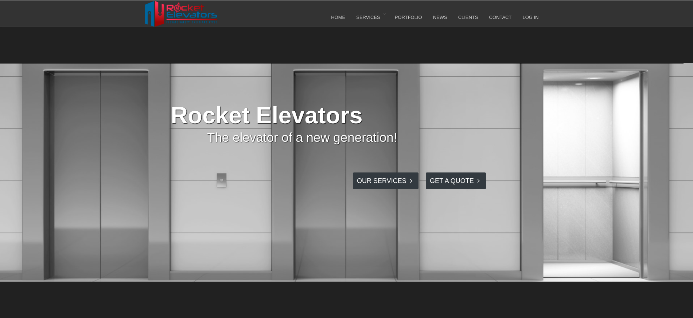
</a>


### Built With

* [Ruby v2.6.6](https://www.ruby-lang.org/)
* [Rails v5.2.4.5](https://rubyonrails.org/)
* [Devise](https://github.com/heartcombo/devise)
* [Faker](https://github.com/faker-ruby/faker)
* [Blazer](https://github.com/ankane/blazer)
* [Bootstrap](https://getbootstrap.com/)
* [Rails Admin](https://github.com/sferik/rails_admin)
  
### Using the following APIs
* [Zendesk](https://github.com/zendesk/zendesk_api_client_rb)
* [Twilio](https://github.com/twilio/twilio-ruby)
* [IBM Watson](https://github.com/watson-developer-cloud/ruby-sdk)
* [Sendgrid](https://github.com/sendgrid/sendgrid-ruby)
* [Dropbox](https://github.com/waits/dropbox-sdk-ruby)
* [Google Cloud Vision](https://github.com/googleapis/google-cloud-ruby/tree/master/google-cloud-vision)
* [Recaptcha](https://github.com/ambethia/recaptcha)


### Installation

  - Clone the repo
   ```sh
   git clone https://github.com/CoteTommy/Rocket-Elevator-Foundation.git
   ```
   - Once you have cloned the repo, the first thing you should run in your terminal is: `bundle`
> This will get and update the required gems


## :pencil2: To Setup The Database
- Once you have edited your database.yml with the correct infos :arrow_heading_down:
- Run the following command: `rails db:setup`

<a href="https://github.com/CoteTommy/CoteTommy/blob/main/runDbSetup.gif?raw=true">
    
</a>

> That step created the database, migrated, and seeded it


## :pencil2: To Run The Application
- To start the rails server you need to run the following command: `rails s`

<a href="https://github.com/CoteTommy/CoteTommy/blob/main/runRailsServer.gif?raw=true">
    
</a>

> This started the rails server on localhost:3000


## :large_blue_circle: Now That The Server Is Running

- You can access the website by going to the following URL `http://localhost:3000/`

- Then you can login by clicking the button on the top right
  
<a href="https://github.com/CoteTommy/CoteTommy/blob/main/topnav.png?raw=true">
    
</a>

- User credentials :arrow_heading_down:

  1. Admin User :arrow_right: email: `admin@admin` password: `123456`
  2. Employee User :arrow_right: email: `The employee's email` password: `123456`

- To access the back office hover over your name at the right of the top nav bar  then click back office


## :small_blue_diamond: Some Extra Information About The Project

### This responsive website has:

- Admin dashboard allowing the following:
  - View/Edit/Delete everything in the database
  - View a map of the clients with their informations using Google Maps API

- Intervention section allowing the following:
  - Create new interventions allowing to assign the following information
    - Employee assigned to the intervention 
    - Description of the problem
    - Customer selection
    - Building selection (buildings from the selected customer)
    - Battery selection (batteries from the selected building)
    - Column selection (columns from the selected battery) *Optional
    - Elevator selection (elevators from the selected column) *Optional
  - On the intervention creation it also creates a new ticket on ZenDesk

- Quote system allowing the following:
  - Creation of a new quote using the client's information
  - Saving the said quote in a new column inside the Quote table
  - Linking the quotes to a user
  - Being able to edit/delete the quote once logged in


   
### More information about the APIs

- Google Maps API
  - It display our customer information based on the geolocalisation of their building in our database
  - It is only accessible trough the admin section on the site
<div align="center">
  <a href="app/assets/images/readMe/gmaps.png">
    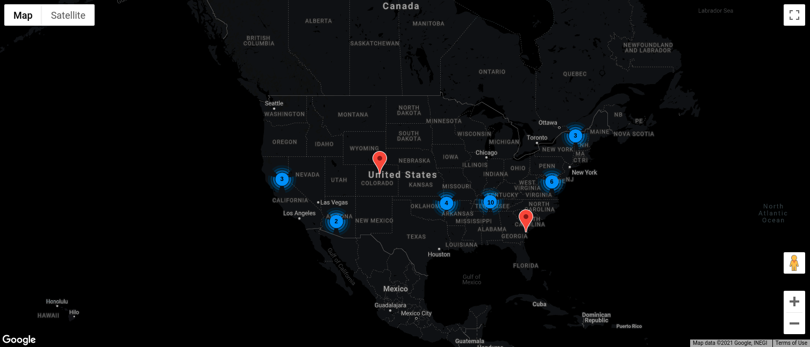
  </a>
</div>


- Twilio API
  - When an elevator status change to "Intervention" the building's technical contact will received a SMS

-  Slack API
    - When an elevator's status change, a message is sent to the slack channel 'elevator_operation'.
    - This leave a written record of the elevators activity

- Dropbox API:
    - When a contact becomes a customers the binary document save in the database is uploaded to dropbox.
    - Then the database is cleared of this document.

- Sendgrid API:
    - When a contact complete a "Contact Us" form a confirmation email is send to the provided contact's email.
<div align="center">  
  <a href="app/assets/images/readMe/confirmationEmail.png">
      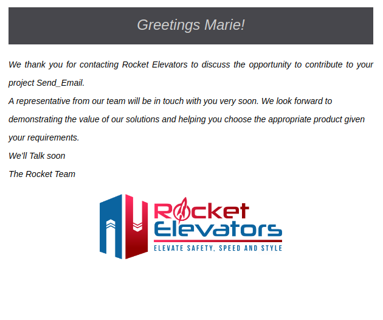
  </a>
</div>

- IBM Watson API:
    - When an user logs in the admin page the authorized user can play an audio file with the following info:
        The type of information that speech synthesis allows are the following:
        Greetings to the logged users
        There are currently XXX elevators deployed in the XXX buildings of your XXX customers
        Currently, XXX elevators are not in Running Status and are being serviced
        You currently have XXX quotes awaiting processing
        You currently have XXX leads in your contact requests
        XXX Batteries are deployed across XXX cities
    - Those info are dynamic and change when the admin page is loaded.
<div align="center">
  <a href="">
      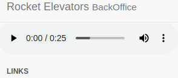
  </a>
</div>

- ZenDesk API:
    - The ZenDesk platform can be powered by a call to the API and the software can then process requests depending on the type.
      - The website's “Contact Us” form creates a new “Question” type ticket in ZenDesk
      - The website's “Get a Quote” form creates a new “Task” type ticket in ZenDesk
      - The tickets created are visible in the ZenDesk Console and it is possible to respond to them or even manage a workflow for these contacts.

- Google Vision API:
    - On a lead creation when there is a image attached, the API analyze it and check the following:
      - Checks for violence
      - Checks for nudity
      - Checks for inappropriate images where it isn't nudity
    - When the check detects that the image is not appropriate it automatically deletes it.

- Recaptcha API:
    - Verifies that the user is not a robot when submitting a new lead.

<br/><br/>

## :pushpin: Elevator Media Module Information

- Folders related to the Module
  ```sh
  .  
  ├─ coverage #SimpleCov report
  │   └── index.html 
  │
  ├─ cypress #Cypress tests
  │   └── integration 
  │         ├── creating_an_intervention.spec.js
  │         └── elevator_media.spec.js
  │
  ├─ lib 
  │   └── elevator_media
  │         └── streamer.rb #The module main file.
  │
  └─ spec #RSpec tests
      ├─── controllers
      │     ├── elevator_media_controller_spec.rb
      │     ├── interventions_controller_spec.rb
      │     └── main_controller_spec.rb
      │
      ├─── features
      │     └── login_management_spec.rb
      │
      ├─── requests
      │     ├── interventions_management_spec.rb
      │     └── quotes_management_spec.rb         
      │
      └─── lib
            └── elevator_media
                  └── streamer_spec.rb
  ```

<br/>

- Elevator Media is a new module created in the lib folder and contains the call Streamer. 
  - The Streamer class contains the following methods
    - getContent(selected, city(optional))
      - This is the main method which calls the other methods to retrieve information. You're able to call every method from getContent.
    - getWeather(city)
      - This method calls the OpenWeather API and retrieve the weather for the city.
    - getJoke
      - This method calls the Chuck Norris api and retrieve a random joke.
    - getGif
      - This method calls the giphy api and retrieve a random cat gif.
    - getAdvice 
      - This method calls the Advice Slip api and retrieve a random advice.
    - getProgJoke
      - This method calls the JokeApi.dev api and retrieve a random programming joke.
    - getDarkJoke 
      - This method calls the JokeApi.dev api and retrieve a random dark joke.

  - Example to call getContent and get the weather in the rails console: `ElevatorMedia::Streamer.new.getContent('1', 'Quebec')` <br /> >This will return an html snippet to display the weather on the website.
    ```text
    Parameters list:
    ('1','*city*') Will return the weather for the specified city.
    ('2') Will return a Chuck Norris joke.
    ('3') Will return a random cat gif.
    ('4') Will return a random advice.
    ('5') Will return a random programmer joke.
    ('6') Will return a random dark joke.
    ```
  
<br/>

### :round_pushpin: New page on the website
  - To access the page click on the new MEDIA button on the navbar
  
    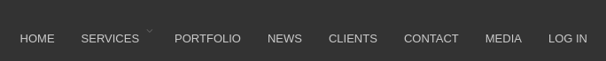

  - Then click on the select menu 
  
    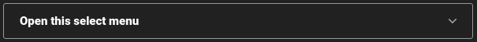

  - Then select the desired option from the dropdown
    - If needed input the city then click the submit button!
  
    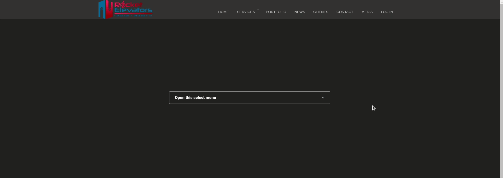

<br/>

### :round_pushpin: RSpec Tests 
  - To run all tests type: `rspec` in the terminal
  
    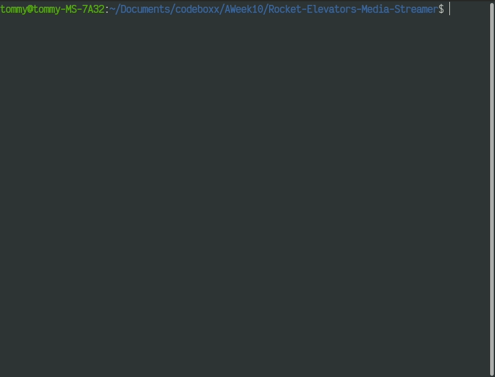 

  - To run an individual test
      ```sh
      rspec ./spec/controllers/main_controller_spec.rb
      rspec ./spec/controllers/elevator_media_controller_spec.rb
      rspec ./spec/controllers/interventions_controller_spec.rb

      rspec ./spec/features/login_management_spec.rb

      rspec ./spec/requests/interventions_management_spec.rb
      rspec ./spec/requests/quotes_management_spec.rb  

      rspec ./spec/lib/elevator_media/streamer_spec.rb
      ```
<br/>

### :round_pushpin: SimpleCov Report
  - After each RSpec tests SimpleCov generates an html page with a lot of useful data (Located in ./coverage/index.html).
  
    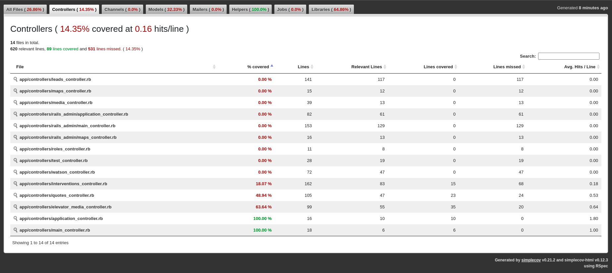
    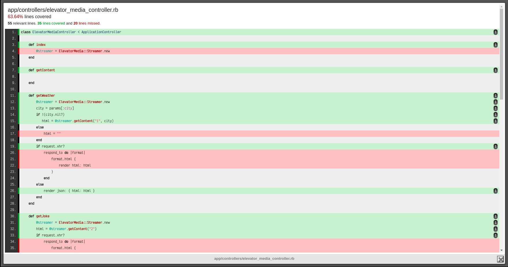

<br/>

### :round_pushpin: Cypress Tests
  - First make sure the rails server is running
  - Type `yarn cypress:open` in the terminal then this window should appear
    
    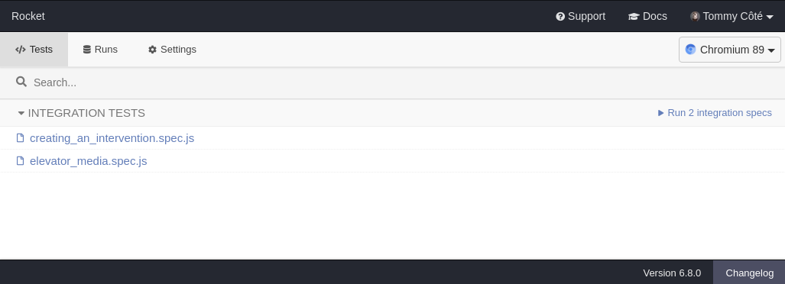

  - Select a test to run and watch it go!
    
    